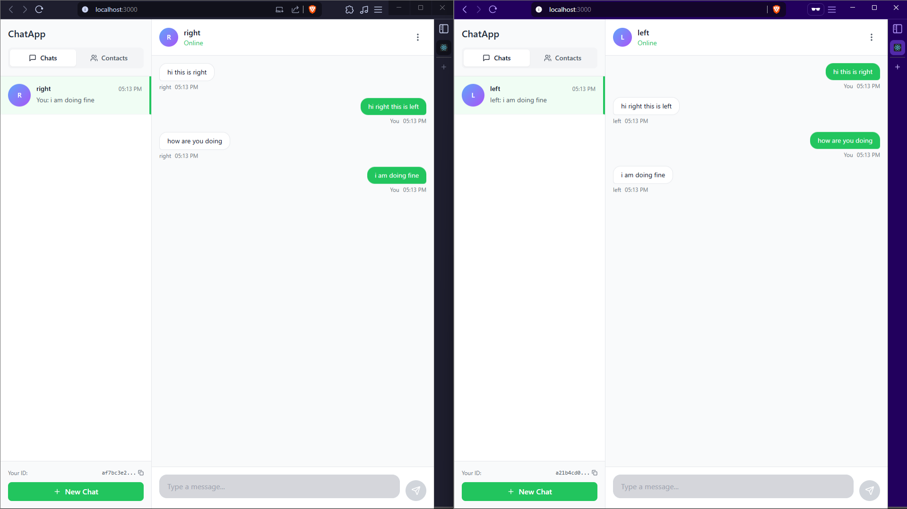

# 💬 CHAT_APP

A simple, real-time chat application built with React and Socket.io.  
Connect, chat, and share messages instantly across devices on your local network!

---

## 🚀 Features

- **Real-time Messaging:** Instant message delivery using WebSockets.
- **Unique User IDs:** Login or generate a new unique ID for each user.
- **Contacts & Conversations:** Add contacts and organize chats.
- **Responsive UI:** Works on desktop and mobile browsers.
- **Local Storage:** Your contacts and conversations are saved locally.

---

## 🖼️ Preview


<sub><sup></sup></sub>

---

## 🛠️ Getting Started

### 1. **Clone the Repository**
```sh
git clone https://github.com/erratus/CHAT_APP.git
cd CHAT_APP
```

### 2. **Install Dependencies**

Open two terminals:

#### **Server**
```sh
cd server
npm install
npm run devStart
```

#### **Client**
```sh
cd client
npm install
npm start
```

if having any troubles regarding versions
run
```sh
$env:NODE_OPTIONS="--openssl-legacy-provider"
```
OR
```sh
set NODE_OPTIONS=--openssl-legacy-provider
```

### 3. **Connect Devices**

- Make sure both your PC and phone are on the same WiFi network.
- On your phone, open your PC's IP address and port (e.g., `http://192.168.1.12:3000`) in the browser.

---

## 📱 Usage

1. **Login:** Enter your unique ID or create a new one.
2. **Add Contacts:** Use the "Contacts" tab to add friends by their ID.
3. **Start Conversations:** Create a new conversation and select contacts.
4. **Chat:** Send and receive messages in real time!

---

## ⚙️ Configuration

- **Server address:**  
  Update the IP in [`client/src/contexts/SocketProvider.js`](client/src/contexts/SocketProvider.js) to your PC's local IP for LAN access.

---

## 📝 License

MIT License

---

## 🙏 Credits

- [React](https://reactjs.org/)
- [Socket.io](https://socket.io/)
- [Bootstrap](https://getbootstrap.com/)

---
